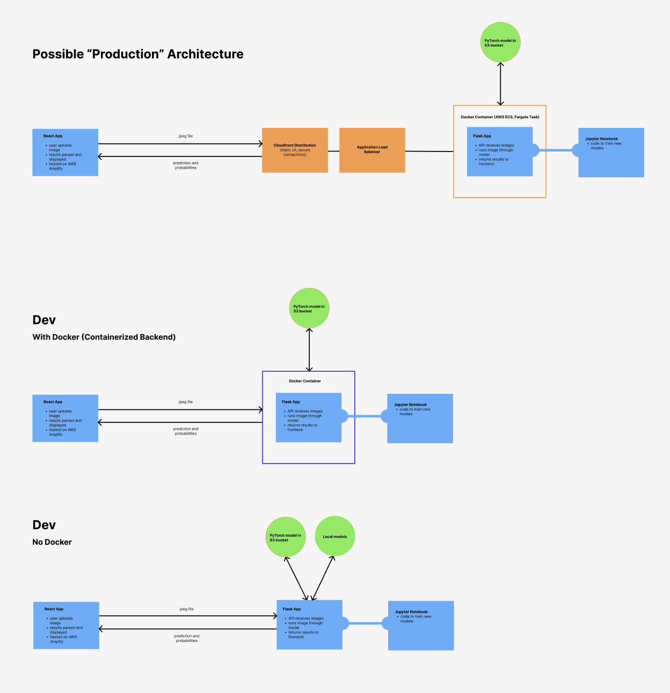

### Overview

I've trained a model to differentiate between my two cats, Kvarg and Jarlsberg.

The model can be run on images uploaded via an API. In a separate repo, I have a React frontend to send these images multiple ways.

## Architecture

These are some ways this might sit in dev or production environments.

### How to run

# If running locally without Docker:

- Create a virtual environment running Python 3.11
- Install dependencies: `pip install -r requirements.txt`
- Run the server: `python app.py`
- It should run on port:80

# To run from Docker

- Get the image from AWS ECR (requires aws cli)
  `aws ecr get-login-password --region eu-west-2 | docker login --username AWS --password-stdin public.ecr.aws/i8x4p3a5`
  `docker pull public.ecr.aws/i8x4p3a5/cat-ai-service:latest`

- Note: there are currently issues with the image size being much larger than it should be.

- Then run the container as normal. For help with Docker see their [documentation](https://docs.docker.com/).

### Challenges

- first time training any kind of model myself
- not enough data initially
- learning how to use the model with an API
- model files are large, need to hosted somewhere (like S3)
- torch is a massive library, too big for lambda, even though the code is so simple. Containerizing worked, but even then it's several GBs.
- AWS kicked me out:(
